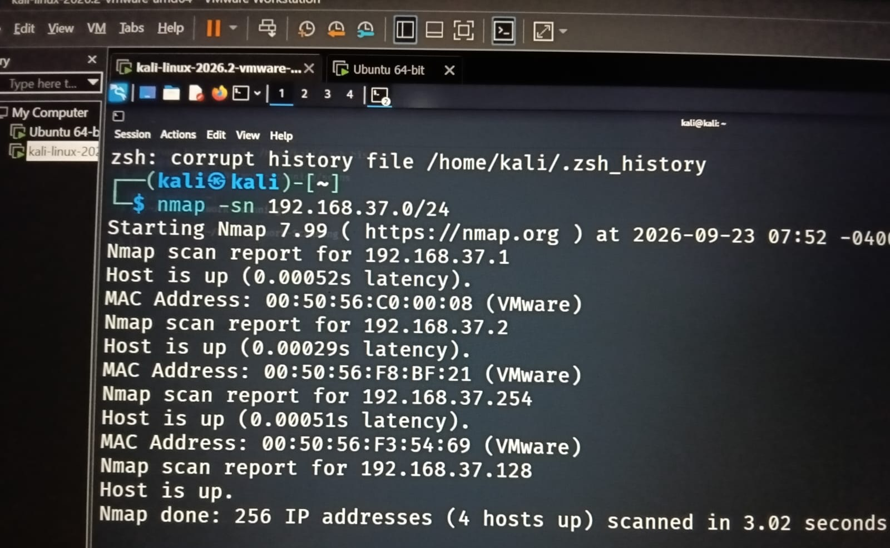
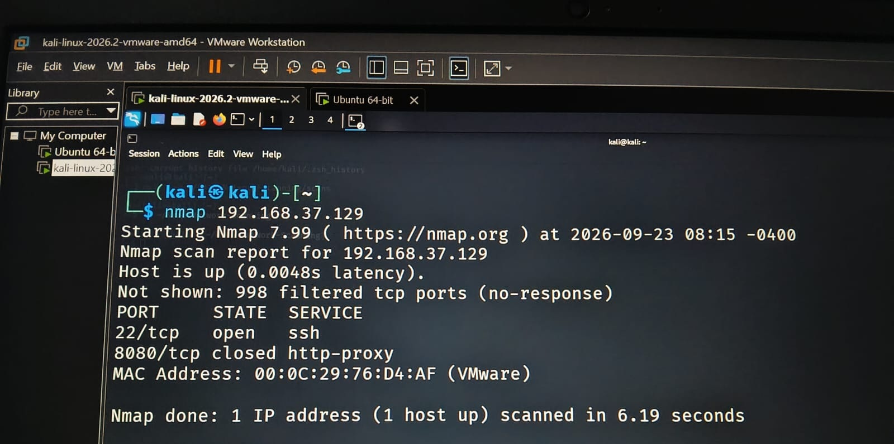
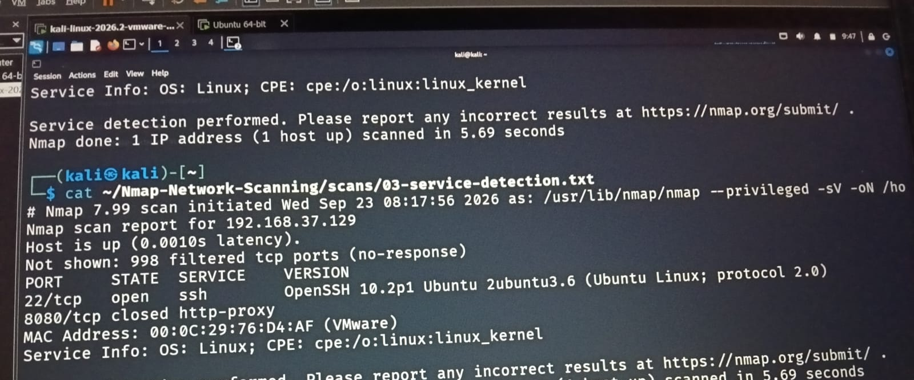
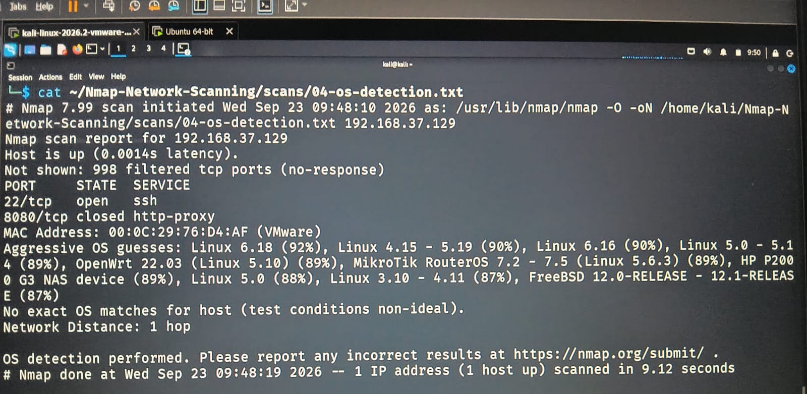

# Nmap Network Scanning & Service Enumeration

## Overview

This project demonstrates network reconnaissance and service enumeration using **Nmap** in a controlled Kali Linux and Ubuntu lab environment.

## Objective

* Identify live hosts on the lab network
* Identify open and closed ports
* Detect running services and versions
* Perform operating system detection
* Document scan results for security analysis

## Tools Used

* Kali Linux
* Ubuntu Linux
* Nmap

## Lab Environment

| System       | Role                  |
| ------------ | --------------------- |
| Kali Linux   | Nmap scanning machine |
| Ubuntu Linux | Target machine        |
| Network      | 192.168.37.0/24       |
| Target IP    | 192.168.37.129        |

## Scans Performed

### 1. Host Discovery

Used Nmap host discovery to identify active hosts on the lab network.

```bash
nmap -sn 192.168.37.0/24
```

**Result:** 4 hosts were identified as active.



### 2. Port Scanning

Scanned the Ubuntu target to identify accessible TCP ports.

```bash
nmap 192.168.37.129
```

**Finding:** SSH was open on port `22/tcp`, while port `8080/tcp` was closed.



### 3. Service & Version Detection

Used Nmap service detection to identify the service and version running on open ports.

```bash
nmap -sV 192.168.37.129
```

**Finding:** OpenSSH `10.2p1` was detected on port `22/tcp`.



### 4. OS Detection

Performed operating system detection against the Ubuntu target.

```bash
sudo nmap -O 192.168.37.129
```



## Key Findings

* The Ubuntu host was reachable from Kali.
* SSH was exposed on port `22/tcp`.
* OpenSSH version `10.2p1` was identified.
* Port `8080/tcp` was detected as closed.
* OS detection identified the target as a Linux-based system.

## Security Relevance

Nmap scanning can help security teams identify exposed ports, services, and systems within an authorized environment. These findings can support attack-surface assessment and further security monitoring.

## Evidence

All scan outputs are stored in the `scans/` directory:

* `01-host-discovery.txt`
* `02-port-scan.txt`
* `03-service-detection.txt`
* `04-os-detection.txt`

